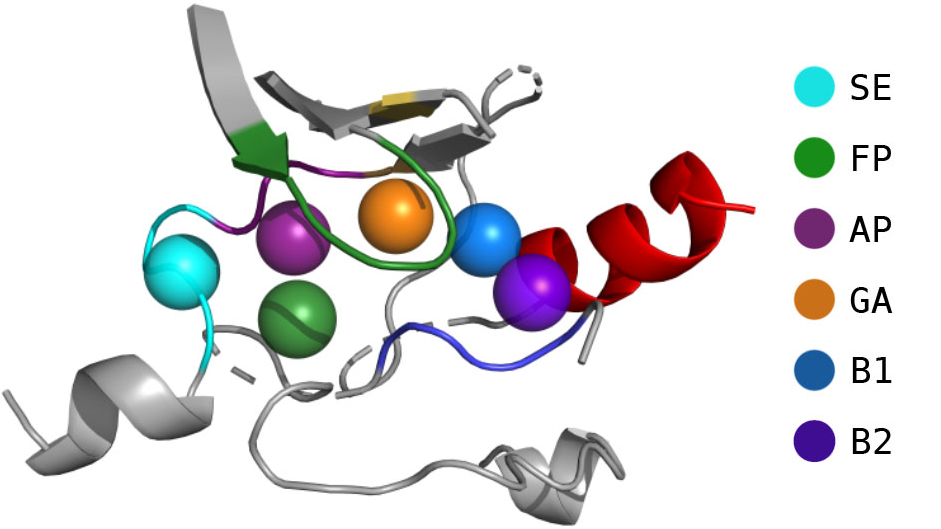

# KinaseFocusedFragmentLibrary

Master Thesis Paula Junge, 2019

### Design of a kinase inhibitor fragment library

## Fragmentation:

For each input kinase-ligand complex, the kinase binding pocket is divided into six subpockets:

* AP = Adenine pocket
* FP = Front pocket
* SE = Solvent-exposed pocket
* GA = Gate are
* B1 = Back pocket I
* B2 = Back pocket II

 

 

The ligands are fragmented according to these subpockets, and the fragments are stored in SD files (one SDF per subpocket).

## Recombination:

Every possible fragment recombination is enumerated in order to create a virtual combinatorial compound library. The fragments are reconnected only at the broken bonds, while preserving the original subpocket arrangements of each bond. The resulting ligands are stored in a binary file containing the fragment IDs and the bonds (as tuples of atom IDs) between the fragments for each ligand. 

