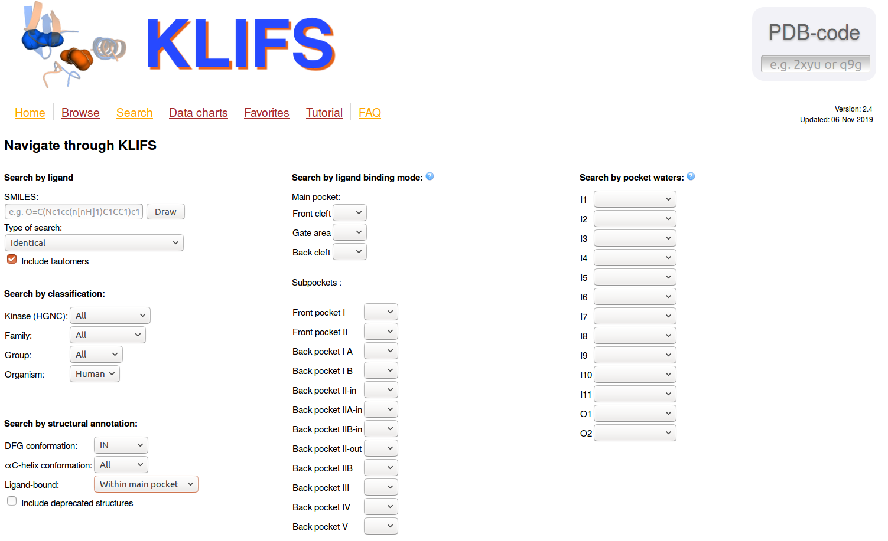

# KinaseFocusedFragmentLibrary

## Exploring the chemical space of kinase inhibitors: Subpocket-based fragmentation for data-driven recombination

### Introduction
Protein kinases play a crucial role in many cell signaling processes, making them one of the most important families of 
drug targets.
Fragment-based drug design has proven useful as an approach to develop novel kinase inhibitors. However, fragment-based 
methods are usually limited to a knowledge-driven approach of optimizing a focused set of fragments. 
Here, we present a data-driven fragmentation and recombination approach instead. 
A novel computational fragmentation method was implemented, which splits known kinase inhibitors into fragments with 
respect to the subpockets that they occupy. Thereby, a fragment library with several pools, representing the subpockets, 
is created.
This fragment library enables an in-depth analysis of the chemical space of known kinase inhibitors, 
and is used to recombine fragments in order to generate novel potential inhibitors.

##### Fragmentation

For each input kinase-ligand complex, the kinase binding pocket is divided into six subpockets. 
The ligands are fragmented according to these subpockets, and a fragment library with several pools is created, 
where each pool corresponds to one subpocket and contains the fragments that were assigned to this subpocket.

 

<br clear="all" />

##### Recombination

Every possible fragment recombination is enumerated in order to create a virtual combinatorial compound library. 
The fragments are reconnected only at the broken bonds, while preserving the original subpocket connection of each bond. 

### Usage

**Note**: Notebooks in this branch will at times not run out of the box due to input/output changes in the library.

#### Dependencies

Create and activate conda environment containing all required packages:
```bash
conda env create -f devtools/conda-envs/environment.yml
conda activate kffl
```

Download and install `kinase_focused_fragment_library` package:
```bash
git clone https://github.com/volkamerlab/KinaseFocusedFragmentLibrary.git
pip install -e KinaseFocusedFragmentLibrary
```

#### Input

Kinase-ligand structures, and two CSV files containing metadata are downloaded from the 
[KLIFS database](https://klifs.vu-compmedchem.nl/index.php) using the following Search options:

 

<br clear="all" />
<br clear="all" />
<br clear="all" />

You will need to do two downloads at the end of the page:
1. Download the structural data via the "DOWNLOAD STRUCTURES" botton (choose the mol2 zip file option). If you are downloading more than 50 structures, you will get an email with a download link. Unpack the downloaded folder: You now have a `KLIFS_download` folder.
2. Download the metadata file (`KLIFS_export.csv`) via the "DOWNLOAD CSV" botton. Please place this file into the `KLIFS_download` folder from step 1.

The downloaded data should now have the following folder structure:

    └── KLIFS_download
        ├── KLIFS_export.csv
        ├── overview.csv
        └── HUMAN     	               # species name  
            ├── AAK1                   # kinase name
            │   ├── 4wsq_altA_chainA   # PDB code, alternate model, chain
            │   │   ├── ligand.mol2
            │   │   ├── pocket.mol2
            │   │   └── ...
            │   └── ...
            └── ...

#### Code

The full fragmentation and recombination workflow consists of the following steps:
1. Preprocessing
2. Fragmentation
3. Optional but highly advised: Fragment library reduction
4. Recombination
5. Recombined molecule analysis

Hint: `/path/to/KLIFS_download` means `/path/to/folder/with/KLIFS_download/folder`.

##### 1. Preprocessing

```bash
kffl-preprocessing 
-f /path/to/KLIFS_download 
-o put/path/to/FragmentLibrary
```
* The output file ```/path/to/KLIFS/data/KLIFS_download/filtered_ligands.csv``` contains metadata on all ligands 
that were chosen for the fragmentation. 
* Metadata on the discarded ligands is written to ```put/path/to/FragmentLibrary/discarded_ligands/preprocessing.csv```.

##### 2. Fragmentation

```bash
kffl-fragmentation 
-f /path/to/KLIFS_download 
-o /path/to/fragment_library
```
* A picture of each fragmented ligand is drawn and stored in ```/path/to/fragment_library/fragmented_molecules/```
* Metadata on discarded ligands is written to ```/path/to/fragment_library/discarded_ligands/fragmentation.csv```.
* The fragment library is written to  ```/path/to/fragment_library```. 

For each subpocket, one folder containing one SD file exists:

    └── fragment_library
        ├── AP.sdf
        ├── B1.sdf
        ├── B2.sdf
        ├── FP.sdf
        ├── GA.sdf
        ├── SE.sdf
        └── X.sdf
        ├── discarded_ligands
        │   ├── fragmentation.csv
        │   └── preprocessing.csv        
        └── fragmented_molecules
            ├── 4wsq_altA_chainA.png
            └── ...

In addition to the standard fields of the SDF format (3D coordinates of each atom and bonds between atoms), 
the files include the following associated data for each fragment:

* PDB code of the original kinase-ligand complex and of the ligand itself
* Chain and alternate model of this complex in KLIFS
* Kinase, kinase family, and kinase group
* Subpocket of each atom, including dummy atoms
* BRICS environment type for each atom (with dummy atoms having 'na' assigned)

##### 3. Optional but highly advised: Fragment library reduction

Necessary step to proceed with recombination step (otherwise computational too expensive): 
To reduce the number of fragments in the fragment library using Butina Clustering, run the notebook

https://github.com/volkamerlab/KinFragLib/blob/master/notebooks/3_1_fragment_library_reduced.ipynb

This notebook generates a folder called `fragment_library_reduced`

    └── fragment_library
        └── ...
    └── fragment_library_reduced
        ├── AP.sdf
        ├── B1.sdf
        ├── B2.sdf
        ├── FP.sdf
        ├── GA.sdf
        ├── SE.sdf
        ├── X.sdf    
        └── configuration.txt

##### 4. Recombination

The recombination step should be performed on a cluster:

```bash
kffl-recombination 
-f /path/to/fragment_library_reduced
-o /path/to/combinatorial_library 
-s AP 
-d 4
```
* The SDF files in the ```/path/to/fragment_library``` are used as input for the recombination, while the above folder 
structure and file names are expected.
* The ```-s``` option specifies one or multiple subpockets from which the recombination procedure will start,
meaning that all resulting molecules will contain a fragment coming from this subpocket/these subpockets 
(default: all subpockets). 
* The ```-d``` option specifies the maximum number of fragments to combine (default: 6).
* Multiple binary (pickle) files are written to ```/path/to/combinatorial_library/results/```, 
which contain pickled objects representing the recombined molecules. For each molecule, this object contains the 
fragment IDs and the bonds (as tuples of atom IDs) between the fragments. 

##### 5. Recombined molecule analysis

Download file ```chembl_25_chemreps.txt``` here: https://chembl.gitbook.io/chembl-interface-documentation/downloads.

Standardize ChEMBL data in this file using:
 
```bash
kffl-chembl 
-f chembl_25_chemreps.txt 
-o chembl_standardized_inchi.txt
```

The analysis step should be performed on a cluster:

```bash
kffl-ligand-analysis 
-f /path/to/fragment_library_reduced 
-klifs /path/to/KLIFS_download 
-chembl chembl_standardized_inchi.txt 
-o /path/to/combinatorial_library
```

* Only in this step, the recombined molecules are constructed as actual Molecule objects. 
* These molecules are then compared to the molecules given in ```chembl_standardized_inchi.txt``` 
(which should contain one standardized InChI string per line) and 
to the original KLIFS ligands from which the fragments were built.
* For each molecule, an object is stored in the file ```/path/to/combinatorial_library/cominatorial_library.pickle``` 
which includes the representation of the molecule as created in the recombination step, its number of heavy atoms, 
as well as binary values describing whether the molecule
  * fulfills Lipinski's rule of five,
  * has a molecular weight <= 500,
  * has a logP <= 5,
  * has a number of hydrogen bond donors <=5 and acceptors <= 10,
  * was found in the original ligands,
  * is a true substructure of an original ligand,
  * was found in ChEMBL.

* Jupyter notebooks for analyzing these objects are stored in 
```kinase_focused_fragment_library/analysis/ligand_analysis/```, 
including a ```quick_start.ipynb``` introducing the basic steps for working with the combinatorial library data.
